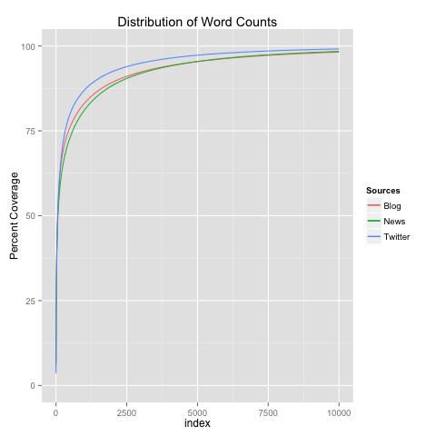
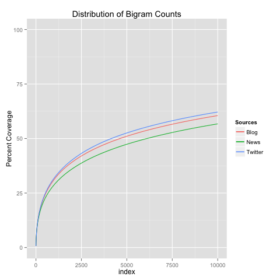

```{r setoptions, echo=FALSE}
knitr::opts_chunk$set(echo = TRUE,  warning = FALSE)
```
# Synopsis

### Objective
This progress report demonstrates basic handling of the data for this project as well as the early implementation of a word prediction algorithm

### Findings
The complexity of the task is driven by a multiplicity of elements

- Large size of data sets

- Statistical properties characterized by a "long tail"

- Complexity of the algorithms, not only to compute a model, and implement it, but also in the details involved in cleaning the data (i.e. extracting words from text)

- Complexity of the overall task itself: a proper prediction algorithm requires additional intelligence beyond the scope of this project, such as: understanding context and basic grammar

# Data
### Large Data Set
To state the obvious, the data sets that we manipulated were very large. As the 2nd column of the Unix "wc" command shows, each source file contains 30-40 Million words (The first column shows number of lines/sentences, the third column indicates the number of characters in the file)
```
wc en_US/*.txt
  899288 37334690 210160014 en_US/en_US.blogs.txt
 1010242 34372720 205811889 en_US/en_US.news.txt
 2360148 30374206 167105338 en_US/en_US.twitter.txt
```

### Long Tails
As the two figures below show, it only takes a couple thousand single words to cover 90%, or more, of the number of instances in each data source. However, with 10,000 bigrams we only cover 55-65% of bigrams occurences in each data source. Furthermore, as the section below shows, these "core" sets are distinct enough that a single set cannot be used for the 3 use cases.





### Diverse Dictionary's
The following shows the maximum index of the top 100 words in the News data source. This shows that one of the top 100 words in News ("county", #100) is actually the 1513th most frequent in the Blogs, and another word ("percent", #94) is the 2223th most frequent in the Twitter data source

```
[1] "Index of the top 100 News words, in other sources"
   News    Blog Twitter 
    100    1513    2223 
```

# Processing Pipeline

## Creating a dictionary

- Unix dict is not enough => 
- removing bad words
- removing stop words - including single letters

## Creating a Model

Note that the shiny app that we are building will accept input for mulitple sources (blogs, news, twitter), we need to build an aggregate model that combines the data from the 3 corpora.
In "real-life", however, there is a good chance that the environment in which the predictor is used is known and defined, in which case we'd use a model that has been tuned for that corpus.


The data is processed according to the processing pipeline:

- The original source data is cleaned using Unix commands 'sed' and 'tr' to remove non-alphabetical characters and to convert to lower case

- The next step is create a reference set of tokens
    - Unique set of tokens
    - rewrite input cleaned up for future processing (and iterations) 
- Count occurence of each token in the reference set in each corpus
- Merge the reference set from the 3 corpora, by taking the 1-grams that make up 90% of the aggregate occurences


-  "tokenized" and stored in tokenized form, to be used by the following stages in the pipeline

- N-gram modeling

## Predictor

- Pre-process the sentence
    - Alphabetic only & lowercase
    - Remove bad words, stop words and words not in dictionary
- Prediction using Markov model with backoff


 


# Plans for Shiny App

* Implement the Shiny App framework (ui.R and server.R)

* Improve the sophistication of the tokenization

    * for example, by replacing plural nouns to singular: See [A List of 100 Irregular Plural Nouns in English](http://grammar.about.com/od/words/a/A-List-Of-Irregular-Plural-Nouns-In-English.htm)
    
    * Handling single-apostrophy: I'm, I'd, my friend's
    
    * Eliminating articles (a, an, the) in the modeling, but including them in the prediction
    
    * Find a more comprehensive dictionary
    
* Improve computational performance - mostly in the modeling section

* Improve the prediction algorithm by implementing Kneser-Ney

# Dictionary
First attempt was to use the Linux dictionary file, but simple words are missing such as "academia" and "kid"

./mk-list american 50 > bf_dict.txt

# References

* List of English stopwords: http://xpo6.com/list-of-english-stop-words/ 
